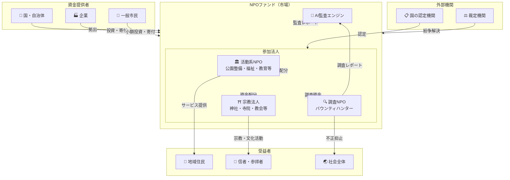

# NPOファンド：エコシステム登場人物・シナリオ分析

> **関連ドキュメント:** [コンセプトペーパー](./01_concept_paper.md)

---

## 1. ステークホルダーマップ



---

## 2. 各ステークホルダーの詳細

### 2.1 活動系NPO — 「地域の守り手」

**プロファイル例：** 里山保全NPO「やまもり」（仮称）

| 項目 | 内容 |
|------|------|
| 活動内容 | 中山間地域の里山保全、獣害対策、子ども自然体験 |
| 年間予算 | 約800万円（うち補助金500万円、寄付300万円） |
| スタッフ | 正規2名、ボランティア約30名 |
| 課題 | 補助金の申請作業が膨大、成果の可視化が困難 |

**NPOファンドで変わること：**
- 補助金申請書類の作成負荷 → **AIが活動レポートを自動生成**
- 年1回の報告 → **リアルタイムの活動データ公開**
- 補助金の打ち切りリスク → **市場評価が高ければ安定的に資金が流れる**
- 「何をやってるか分からない」→ **活動のインパクトが数値で見える**

### 2.2 宗教法人 — 「千年の継続者」

**プロファイル例：** 地方の古刹「瑞雲寺」（仮称、創建800年）

| 項目 | 内容 |
|------|------|
| 活動内容 | 法要、地域行事、墓地管理、文化財保全 |
| 年間収入 | 約1,200万円（お布施700万、墓地管理300万、その他200万） |
| 住職 | 1名（兼業） |
| 課題 | 檀家の減少、建物の維持費、後継者不足 |

**NPOファンドで変わること：**
- 檀家だけに依存 → **地域外からも「文化財保全」として資金を得られる**
- 不透明と見られがち → **AI監査で透明性を証明、信頼を獲得**
- 宮大工等の文化技術 → **「日本の伝統技術を残す投資」としてブランディング可能**

### 2.3 調査NPO（バウンティハンター） — 「市場の免疫系」

**プロファイル例：** 公益調査法人「クリアライト」（仮称）

| 項目 | 内容 |
|------|------|
| 活動内容 | 公益法人の運営実態調査、受益者ヒアリング、不正証拠の収集 |
| スタッフ | 調査員5名（全員国家認定取得） |
| 収入源 | ファンドからの調査資金 + 有益情報提供報奨金 |
| 倫理規定 | 国の認定機関が策定。違反で即認定取消 |

**既存の類似職種との比較：**

| 職種 | 調査NPOとの違い |
|------|----------------|
| 監査法人 | 財務書類の監査が中心。現場に行かない。コストが高い |
| 探偵 | 個人の依頼。公益目的ではない。法的位置づけが曖昧 |
| 内部告発者 | 組織の内部者。保護制度はあるが不十分 |
| 調査報道記者 | メディア所属。報道が目的で、制度的な位置づけがない |
| **調査NPO** | **公益目的で国が認定。ファンド内で透明性を担保。制度的に位置づけ** |

**バウンティハンターの「段位」制度案：**

```
Level 1: 見習い調査員
  — 認定研修修了、先輩調査員に同行のみ
  — 反社チェック（基礎）

Level 2: 正調査員
  — 独立した調査活動が可能
  — 反社チェック（詳細） + 定期的な更新審査
  — 過去の調査実績による信頼スコア蓄積

Level 3: 主任調査員
  — 複数調査の統括が可能
  — 裁定機関への証拠提出権限
  — 調査NPO設立の推薦資格

Level 4: 認定調査官
  — 国の認定機関と連携した特別調査
  — 新人調査員の研修・認定審査への参加
  — 制度設計へのアドバイザリー参加
```

---

## 3. ユースケースシナリオ

### シナリオ A：善良な組織が正当に評価される

```
① 里山保全NPO「やまもり」がファンドに参加申請
② 国の認定機関が反社チェック・活動実態を審査 → 認定
③ AI監査エンジンが財務データを接続、活動トラッキング開始
④ 四半期ごとにAI生成のインパクトレポートが公開される
   — 保全した森林面積、参加した子どもの数、地域住民の満足度etc.
⑤ 地域の住民がファンドを通じて「やまもり」に少額投資
⑥ 県外の企業がCSR枠でまとまった資金を投入
⑦ 活動が可視化されることで、ボランティア応募も増加
⑧ 市場評価が高まり、マーケットファンドからの配分が増加

→ 結果: 補助金依存から脱却し、持続可能な資金基盤を獲得
```

### シナリオ B：不正組織が淘汰される

```
① 宗教法人X（実態はペーパーカンパニー）がファンドに参加
② AI監査が以下の異常を検知:
   — 信者数に対して不自然に大きな資金流入
   — 海外送金のパターンが不規則
   — 活動レポートの内容と公開データの不整合
③ AIが「要調査」フラグを立てる
④ 調査NPO「クリアライト」が現地調査を実施
   — 施設が実質的に使われていない
   — 信者へのヒアリングで活動実態がないことを確認
   — 資金の流れを追跡し、マネーロンダリングの疑いを報告
⑤ 調査結果がファンドに提出、市場に公開
⑥ 法人Xの市場評価が急落、資金配分がゼロに
⑦ 裁定機関が審査 → 認定取消
⑧ 国の認定機関が関係当局に情報提供 → 刑事捜査へ

→ 結果: 不正法人が市場メカニズムで自然に排除される
```

### シナリオ C：虚偽告発への対処

```
① 調査NPO「シャドウ」が宗教法人Y（健全な地域の神社）に対して
  「不正の疑い」レポートを提出
② 神社Yの市場評価が一時的に下落
③ AI監査エンジンが双方のデータを分析
   — 神社Yの財務データに異常なし
   — 調査NPO「シャドウ」の過去レポートに不正確な記述が複数
④ 裁定機関が調査を開始
⑤ 調査の結果、「シャドウ」のレポートに根拠がないと判定
⑥ 調査NPO「シャドウ」の信頼スコアが大幅に下落
⑦ 「シャドウ」への資金配分が減少
⑧ 悪質と判断された場合、認定取消 + 損害賠償

→ 結果: 虚偽告発が自律的に抑制される仕組みが機能
```

### シナリオ D：一般市民の参加

```
① 会社員の田中さん（30代）が「地元の神社を残したい」と考える
② NPOファンドのアプリで近隣の参加法人を検索
③ 地元の八幡宮のAI監査レポートを閲覧
   — 透明性スコア: 92/100
   — 社会的インパクト: 地域行事年12回、参拝者年間3万人
   — 文化財保全: 鳥居の修繕計画進行中
④ 月額1,000円の定期投資を設定
⑤ 四半期ごとに活動レポートを受け取る
⑥ 年末に寄付金控除を自動申請（AI支援）
⑦ 神社の修繕完了時に「あなたの投資が貢献しました」通知

→ 結果: 小額でも意味のある社会貢献が可能に
```

---

## 4. 市場の健全性メカニズム

### 4.1 三重の防御ライン

```
第1防御線: AI監査エンジン（常時・自動）
    — 財務異常検知
    — データ整合性チェック
    — 不正パターンの予兆検出
         ↓ 異常検知時
第2防御線: 調査NPO / バウンティハンター（人間・調査）
    — 現地確認
    — 関係者ヒアリング
    — 物的証拠の収集
         ↓ 不正確認時
第3防御線: 裁定機関（判断・処分）
    — 証拠の審査
    — 認定取消の判断
    — 関係当局への情報提供
    — 損害賠償の裁定
```

### 4.2 インセンティブ設計の均衡

全参加者が自分の利益を追求することで、全体が健全に保たれる設計を目指す：

| 参加者 | 利益 | 不正時のペナルティ |
|--------|------|-----------------|
| 活動NPO | 資金を得る | 市場評価下落→資金停止→認定取消 |
| 宗教法人 | 資金+信頼+税制優遇 | 同上 |
| 調査NPO | 報奨金+活動資金 | 信頼スコア下落→資金停止→認定取消 |
| 資金提供者 | 税制優遇+社会貢献 | 市場操作は法的処罰 |
| AI監査 | （システム） | 精度の継続的改善が求められる |

---

## 5. 将来的な発展可能性

### 5.1 調査NPOのコンテンツ化

現在YouTube/TikTokで「突撃系」が成立しているが、NPOファンドの枠組みの中で：
- 調査プロセスの**ドキュメンタリー化**
- 調査結果を**教育コンテンツ**として活用
- 市民の**リテラシー向上**に貢献

→ コンテンツ収入が調査NPOの追加収入源となり、独立性が強化される。

### 5.2 地方創生との接続

NPOファンドは地方の公益活動に全国・海外から資金を呼び込む仕組みとしても機能する：
- 都市部の住民が**出身地の神社や里山に投資**
- 外国人が**日本の文化財保全に資金を出す**（クールジャパン的文脈）
- **ふるさと納税**の進化版としてのポジショニング

### 5.3 国際展開

この仕組みは日本固有の問題から出発しているが、モデル自体は汎用的：
- 途上国のNGOへの透明な資金配分
- 宗教組織の監査（イスラム圏のワクフ制度等）
- グローバルな公益活動の市場化
