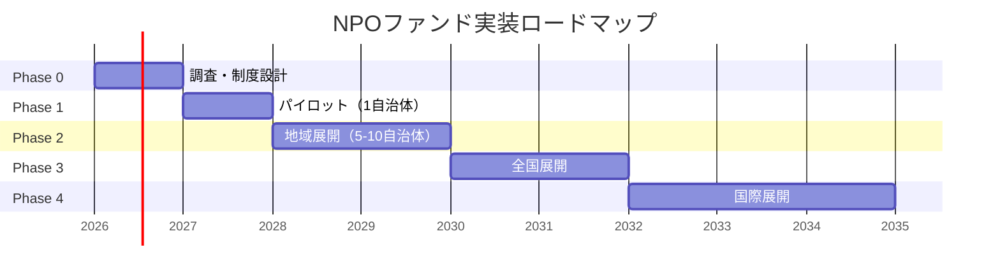

# NPOファンド：段階的実装ロードマップ

> **関連ドキュメント:** [コンセプトペーパー](./01_concept_paper.md) | [エコシステム分析](./02_ecosystem_and_scenarios.md)

---

## フェーズ概要



---

## Phase 0：調査・制度設計（〜1年）

### 目標
制度の法的・技術的基盤を固め、パイロットプログラムの設計を完了する。

### やること

| タスク | 詳細 | 担当候補 |
|--------|------|---------|
| **法制度調査** | NPO法・宗教法人法・税法との整合性分析 | 法律事務所 + 有識者委員会 |
| **AI監査エンジン PoC** | 既存NPOの公開データで監査プロトタイプを構築 | テック企業 / スタートアップ |
| **ステークホルダーヒアリング** | NPO・宗教法人・自治体・有識者へのインタビュー | プロジェクトチーム |
| **海外事例調査** | 英国SIB、米国DAO、豪州SII等の詳細分析 | リサーチチーム |
| **認定基準の策定** | 参加法人 + 調査NPOの認定要件設計 | 有識者委員会 |
| **パイロット自治体の選定** | 理念に共感し、適切な規模の自治体を選定 | プロジェクトチーム |

### 成果物
- 法制度分析レポート
- AI監査エンジンの技術仕様書
- パイロットプログラム実施計画書
- 認定基準ドラフト

---

## Phase 1：パイロット（1自治体、1〜2年）

### 目標
1つの自治体で限定的にファンドを実験し、仕組みの有効性を検証する。

### 設計

```
パイロット規模:
  — 参加NPO: 10〜20法人
  — 参加宗教法人: 5〜10法人（任意参加）
  — 調査NPO: 2〜3法人
  — 資金規模: 年間1〜3億円
  — 資金構成: 自治体拠出70% + 企業・市民30%
```

### パイロットで検証すべき仮説

| # | 仮説 | 検証方法 |
|---|------|---------|
| H1 | AI監査は従来の監査より低コストで高精度 | 監査コスト比較 + 異常検知精度の測定 |
| H2 | 市場評価は活動の質と相関する | 評価スコアと受益者満足度の相関分析 |
| H3 | 一般市民が資金提供に参加する | ファンドへの市民参加率・投資額 |
| H4 | 調査NPOの存在が不正を抑止する | 参加前後の不正件数比較 |
| H5 | 組織はAI監査を受け入れる | 参加率・脱退率・満足度 |
| H6 | ベースファンド+マーケットファンドの二層構造が機能する | 資金配分の偏り度合い |

### パイロット自治体の理想条件
- NPO・宗教法人が一定数存在する中規模の自治体
- 首長がイノベーティブ（e.g. 東近江市はSIBの先例あり）
- 行政のデジタル化が進んでいる
- 地域コミュニティが活発

---

## Phase 2：地域展開（5〜10自治体、2年）

### 目標
複数の自治体に展開し、地域間比較と制度の改善を行う。

### 拡張要素

| 要素 | Phase 1 → Phase 2 の変化 |
|------|-------------------------|
| 規模 | 1自治体 → 5〜10自治体 |
| 資金 | 年間1〜3億円 → 年間10〜30億円 |
| 資金構成 | 自治体70% → 自治体50%, 市場50% |
| 調査NPO | 2〜3法人 → 10〜20法人 |
| AI監査 | PoC → 本格運用 |
| 法制度 | 特区的運用 → 法改正の検討開始 |

### Phase 2での追加機能

1. **組織間ベンチマーキング**: 類似活動を行う組織同士の比較レポート
2. **地域横断投資**: 他自治体の住民からの投資受け入れ
3. **調査NPOの認定制度の本格化**: 段位制度（Level 1〜4）の実運用
4. **ファンド運営のDAO的要素の試験導入**: 投資家投票の実験

---

## Phase 3：全国展開（2年）

### 目標
NPOファンドを全国的なインフラとして確立する。

### 制度化に必要な法的対応

| 法令 | 必要な対応 |
|------|-----------|
| NPO法 | ファンド参加認定の法的根拠を追加 |
| 宗教法人法 | 任意参加制度の規定 |
| 税法 | ファンド投資の税制優遇の法的根拠 |
| 新法（NPOファンド法？） | 市場運営、認定機関、裁定機関の法的根拠 |

### 全国展開時のインフラ

```
┌─────────────────────────────────┐
│     NPOファンド・プラットフォーム   │
│                                 │
│  Web / アプリ                    │
│  ├── 組織検索・比較               │
│  ├── 投資・寄付（小額〜大口）     │
│  ├── AI監査レポート閲覧           │
│  ├── 調査レポート閲覧             │
│  ├── インパクトダッシュボード      │
│  └── 税制優遇の自動計算・申請     │
│                                 │
│  API                            │
│  ├── 自治体連携                   │
│  ├── 金融機関連携                 │
│  └── AI監査エンジン               │
└─────────────────────────────────┘
```

---

## Phase 4：国際展開（3年〜）

### 目標
日本発のモデルとして国際的に展開する。

### 展開可能性のある地域

| 地域 | 接続点 |
|------|--------|
| 東アジア | 寺院・廟・宗教法人の類似構造 |
| 東南アジア | NGO・宗教施設の透明性課題 |
| 中東 | ワクフ（イスラム寄進制度）の近代化 |
| 欧米 | 既存のSIB・DAOとの統合 |

---

## リソース見積もり

### Phase 0（調査・設計）

| 項目 | 概算コスト |
|------|-----------|
| 法制度調査 | 2,000万円 |
| AI監査PoC開発 | 5,000万円 |
| ステークホルダーヒアリング | 500万円 |
| 海外事例調査 | 1,000万円 |
| プロジェクト運営 | 3,000万円 |
| **合計** | **約1.15億円** |

### Phase 1（パイロット / 年間）

| 項目 | 概算コスト |
|------|-----------|
| ファンド原資 | 1〜3億円 |
| AI監査エンジン運用 | 3,000万円 |
| 調査NPO活動費 | 2,000万円 |
| プラットフォーム開発・運用 | 5,000万円 |
| 認定機関の運営 | 2,000万円 |
| **合計** | **約3〜5億円/年** |

---

## 成功指標（KPI）

| フェーズ | KPI | 目標値 |
|---------|-----|--------|
| Phase 1 | 参加法人数 | 15〜30 |
| Phase 1 | 市民参加率（自治体人口比） | 1%以上 |
| Phase 1 | AI監査の異常検知精度 | 90%以上 |
| Phase 1 | 参加法人の満足度 | 70%以上 |
| Phase 2 | 参加法人数 | 200〜500 |
| Phase 2 | 資金規模（年間） | 30億円以上 |
| Phase 3 | 全国の参加法人数 | 5,000以上 |
| Phase 3 | 補助金依存度の減少幅 | 30%以上削減 |
