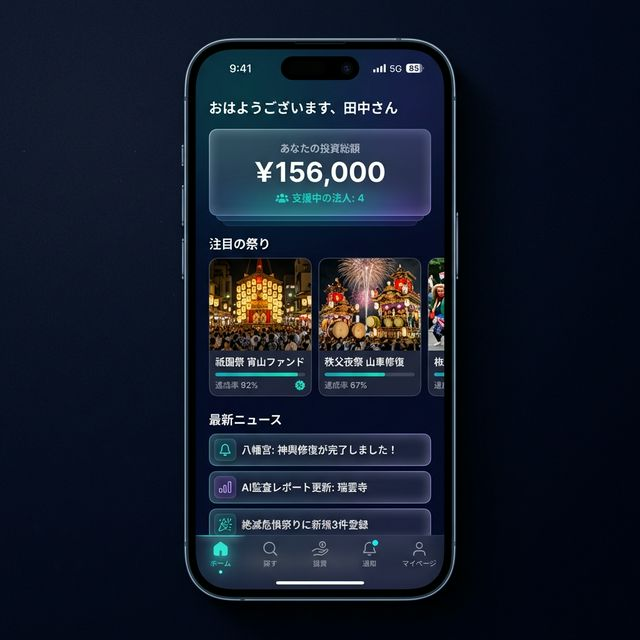
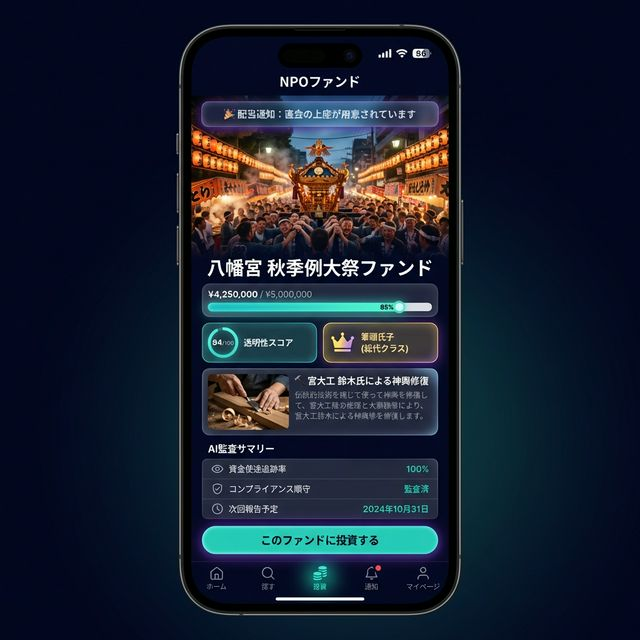
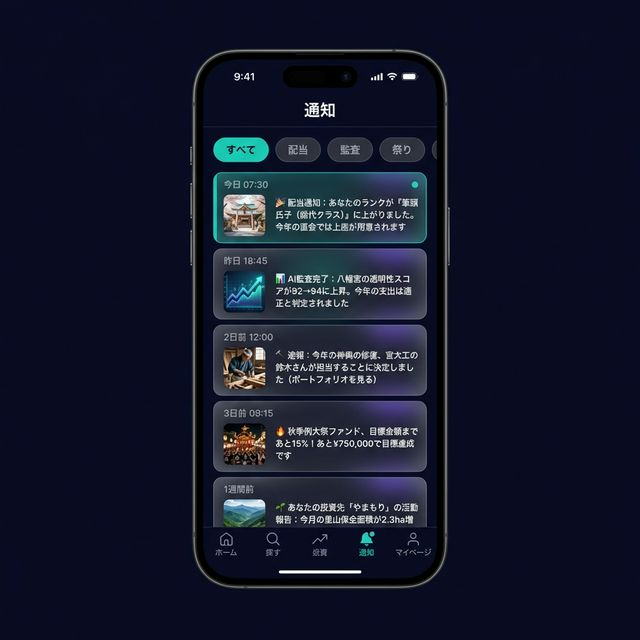
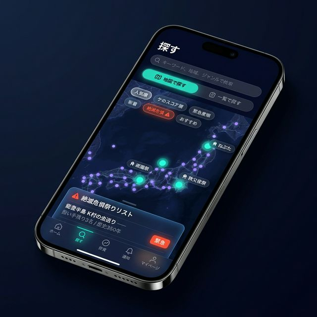
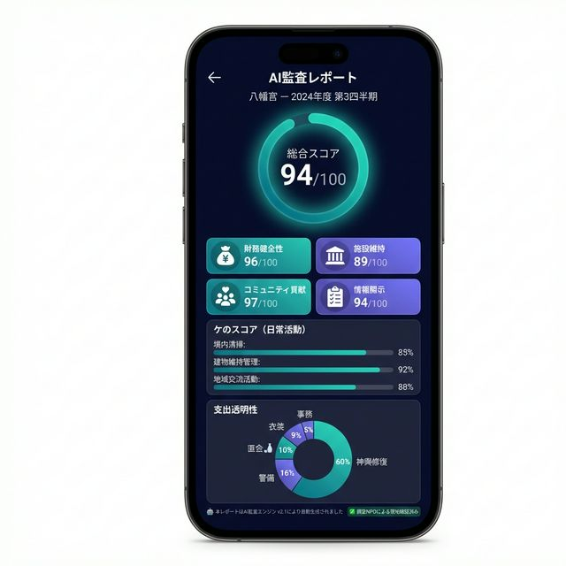
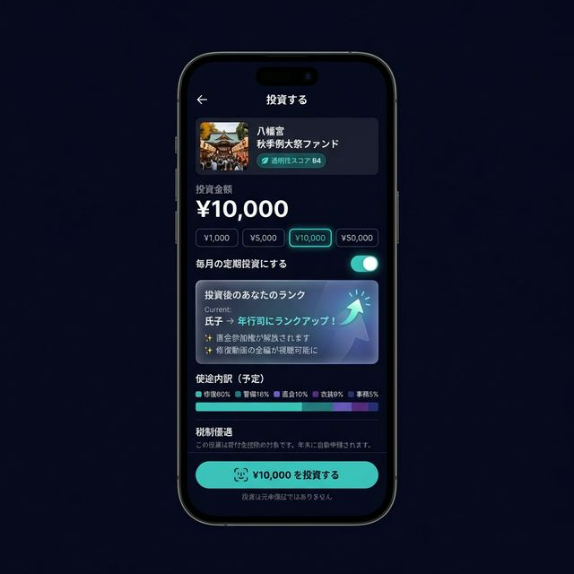
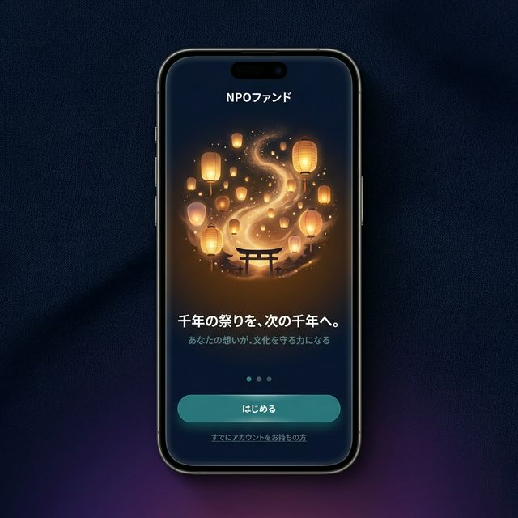
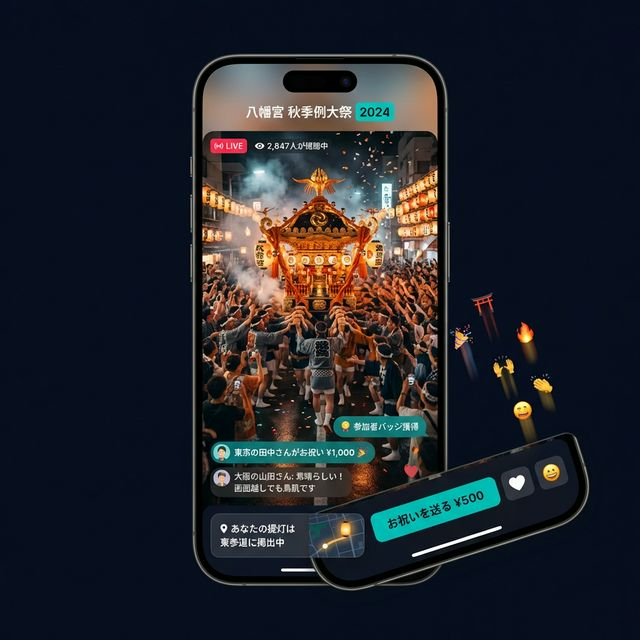

# 祭りのDXと「共同体の証明」 — NPOファンドの実証モデル

> **関連ドキュメント:** [コンセプトペーパー](./01_concept_paper.md) | [エコシステム分析](./02_ecosystem_and_scenarios.md)
> **Status:** Draft v0.1 — 2026-02-13

---

## はじめに — なぜ「祭り」なのか

NPOファンド構想は、市場原理とAI監査によって公益活動を持続可能にする制度設計である。しかし制度設計だけでは人は動かない。**「これが実現するとどうなるのか」という完成予想図**が必要だ。

祭り（Matsuri）は、その最強のモデルケースである。

理由は明快だ。祭りは、NPOファンドが必要とするすべてを自然に備えている：

- **可視的な成果** — 1万人が踊っている光景は偽造できない
- **定量化可能なKPI** — 動員数、経済効果、SNS拡散
- **感情的な磁力** — 遠方の人間を巻き込む力を持つ
- **文化的不可逆性** — 一度途絶えた祭りは二度と同じ形では復元できない
- **既存のコミュニティ** — 氏子・実行委員という組織がすでにある
- **経済的課題** — 過疎化・少子化で担い手と資金が急速に減少中

そして何より、祭りはNPOファンドが解こうとしている問題の**縮図**でもある。「善意の活動なのに金がない」「透明性がないから外部の協力を得にくい」「行政の補助金頼みは持続不可能」——これらすべてが、全国30万とも言われる祭りの現場で起きている。

---

## 1. 概念定義：Proof of Community（共同体の証明）

### 1.1 偽造不可能なKPI

金融の世界にはProof of Work（計算力の証明）やProof of Stake（保有量の証明）がある。NPOファンドにおける祭りは、**Proof of Community（共同体の証明）** という新しい信用概念を提示する。

**財務レポートはAIで偽造できる。しかし、1万人が路上で踊り、10トンの神輿を担ぎ上げる光景は偽造できない。**

祭りの「賑わい」は、その組織と地域が持つ社会的価値の、最も信頼性の高い証明なのだ。

これをデータとして捉えると：

| 指標 | 計測手段 | 偽造難易度 |
|------|---------|----------|
| 来場者数 | IoTセンサー・衛星画像・携帯キャリアデータ | 極めて困難 |
| SNS投稿量 | API分析 | 困難（Bot排除はAIで可能） |
| 地域経済効果 | キャッシュレス決済データ・宿泊データ | 困難 |
| ボランティア参加数 | 参加登録システム | 中程度 |
| メディア露出 | ニュース・動画クリップ分析 | 困難 |
| リピーター率 | 年次比較データ | 困難 |

AI監査が「デジタルな信用」を提供するのに対し、祭りは「フィジカルな信用」を提供する。この二つが揃った組織は、ファンド市場において最高レベルの信頼を得る。

### 1.2 「AI vs AI 問題」への解答

不正組織がAIを使って完璧な偽レポートを生成し、AI監査を突破しようとする — いわゆる「AI対AIのいたちごっこ」問題。祭りはこの問題に対する**構造的な解答**を含んでいる。

なぜなら、**祭りの規模と熱量は、物理世界に痕跡を残すからだ。** デジタルデータだけで完結する不正と異なり、「1万人の参加者」「数十トンの山車」「数日間の交通規制」は物理的にシミュレートできない。衛星写真、携帯基地局の接続数、近隣店舗の売上データ — 独立した複数のデータソースが相互に裏付けを行う。

これは「多層的検証（Multi-source Verification）」と呼べるアプローチであり、単一データソースに依存するAI監査の弱点を補完する。

---

## 2. 新しい身分制度：バーチャル氏子（Virtual Ujiko）

### 2.1 氏子制度の構造的限界

伝統的な氏子は、**「その土地に生まれた（または住んでいる）住民」** として自動的に地域の神社と結びつく。この制度は以下の前提で成立していた：

- 人口が安定しているか、増加傾向にある
- 人口移動が少ない
- 地域コミュニティのつながりが強い

これらの前提は**すべて崩壊している**。人口減少、都市集中、地域コミュニティの希薄化。結果として：

- **氏子の自然減** — 地方では毎年10%以上の減少率を記録する地域もある
- **後継者不在** — 祭りの準備・運営の知識を持つ担い手がいない
- **資金枯渇** — 寄付を贈れる世帯自体が減少

### 2.2 「血縁・地縁」から「志縁」へ

NPOファンドは、この閉じたシステムに**第三のメンバーシップ**を導入する：

```
伝統的氏子:   その土地に生まれた人。自動的に帰属。
転入氏子:     その土地に移り住んだ人。地縁による帰属。
バーチャル氏子: どこに住んでいてもいい。自分の意思で選んでコミットする。
```

「バーチャル氏子」は、ファンドを通じてその神社や祭りに資金を投じることで、以下の関係を形成する：

**権利（配当として受け取るもの）：**
- 祭りの桟敷席の優先予約権
- 神輿を担ぐ権利の抽選資格
- 直会（打ち上げの宴）への参加権
- 名前入り提灯の掲出
- 修繕プロセスの限定映像の視聴
- AI監査レポートの詳細版へのアクセス

**義務（コミットメントとして提供するもの）：**
- 少額でも定期的な資金拠出
- 市場参加者としての投票（評価への参加）

### 2.3 「選んで参加する」コミットメントの強さ

ここに逆説がある。**「たまたまそこに生まれた」人よりも、「自分で選んでコミットした」人の方が、実はコミットメントが強いケースが多い。**

サッカーチームのサポーターを考えれば分かりやすい。地元のクラブを応援する地元民よりも、遠くから毎試合遠征してくるサポーターの方が、支出額も時間投資も大きいことがある。

バーチャル氏子も同じ構造を持つ。「地元にいるけど関心がない」人と、「東京にいるけど毎年祭りに通っている」人。後者の方が、祭りの存続にとって価値が高い場合がある。

NPOファンドは、この「志縁」に制度的な居場所を与える。

---

## 3. 経済モデル：ハレとケの循環

### 3.1 日本文化における二項構造

日本の生活世界は「ハレ」と「ケ」の二つの時間で構成される：

- **ケ（褻・日常）** — 普段の暮らし。労働、清掃、維持管理、日々の祈り。
- **ハレ（晴・非日常）** — 祭り、儀式、祝祭。蓄積されたものが爆発する瞬間。

この二項構造は、実はNPOファンドの**投資/配当サイクルそのもの**だ。

```
┌──────────────── 1年間のサイクル ────────────────┐
│                                                │
│  ケ（364日）= 投資フェーズ                        │
│    ├── 境内清掃・建物維持管理                     │
│    ├── 宮大工による修繕作業                       │
│    ├── 地域住民との日常的交流                     │
│    ├── 若手への技術継承・練習                     │
│    └── AI監査: 日常活動のトラッキング              │
│                                                │
│  ハレ（祭当日〜数日間）= 配当フェーズ               │
│    ├── 投資の成果が「体験」として顕現する           │
│    ├── Proof of Community が物理的に証明される     │
│    ├── バーチャル氏子が「株主優待」を体験する       │
│    ├── 来場者データ・経済効果が記録される           │
│    └── → このデータが翌年の投資判断材料になる       │
│                                                │
└────────────────────────────────────────────────┘
```

### 3.2 祭りは「年次株主総会 ＋ 配当支払い」である

株式会社の年次株主総会を思い浮かべてほしい。退屈で、形式的で、誰も行きたがらない。

祭りは、その**正反対のバージョン**だ：

- 全員が来たがる
- 感情的に熱い
- 実際に「商品」を体験できる（株主総会で自社製品を試食するようなもの）
- 成果が目に見える（にぎわい、山車の美しさ、子どもたちの笑顔）

これは既存のどんな金融商品にも存在しない設計である。**最も楽しい株主総会、最も美しい配当支払い。**

### 3.3 「ケの保護」メカニズム — ハレがケを食う問題の解決

ここに重要な設計上の問題がある。

**市場は「分かりやすいもの」に反応する。** 派手な祭りばかりが評価され、365日のうちたった1日のハレだけで資金配分が決まるなら、残り364日の地道な日常活動（ケ）が軽視される危険がある。

しかし、祭りの質は、ケの積み重ねによってのみ決まる。神輿の漆は日々の手入れで保たれる。山車の車輪は定期的な点検で安全が担保される。子どもたちの笛の腕は、毎週の練習で上達する。

**ケが死ねば、ハレも死ぬ。**

これを防ぐためのAI監査の役割を明確に定義する：

```
投資家（人間）の役割:
  → ハレ（祭り）を見て感動し、評価・投資する

AI監査の役割:
  → ケ（364日の日常活動）を計測・評価し、
    「ハレを実行するための基礎体力スコア」として算出する

制約条件:
  → 「ケ」のスコアが基準値を下回ると、
    マーケットファンド配分にキャップがかかる
  → 逆に「ケ」のスコアが高い組織は、
    ハレの規模が小さくてもベースファンドが厚くなる
```

この設計により：
- 「地味だが毎日欠かさず境内を清めている神社」→ ケのスコアが高い → 安定資金を確保
- 「祭りだけ派手でも日常管理が杜撰な組織」→ ケのスコアが低い → 資金にキャップ

**市場のバイアスをシステムで補正する。** これがAI監査の真骨頂だ。

---

## 4. 「健全に狂う」ためのインフラ

### 4.1 聖なる浪費と透明性の両立

祭りには「無駄遣い」が不可欠である。

神事のあとの**直会（なおらい）** — 神と人が共に飲食する儀式 — は、神道において本質的な機能を持つ。祭りの「パーッと散財する」行為自体が、ケ（日常）で溜まった澱を祓い（はらい）、コミュニティの絆を更新する装置だ。

ここで「AI監査＝コスト削減」と誤解してはならない。

**透明性は、倹約を意味しない。透明性は、浪費を正当化する道具にもなる。**

### 4.2 「隠れて飲む」から「堂々と飲む」へ

従来の問題は、飲食費用の「隠蔽」にあった。「会議費」と偽ったり、帳簿に載せなかったりする。この不透明さが外部からの不信感を生み、若者の離反を招いた。

NPOファンドの枠組みでは、こう宣言できる：

> **「今年の祭り予算：神輿修復 300万円、警備費 80万円、直会（大宴会） 50万円」**

50万円の宴会が、事前に宣言され、AI監査で「申告範囲内で適切に使用された」と認定される。投資家は宴会の存在を知った上で投資している。これは全員が合意した「健全なドンブリ勘定」だ。

むしろ投資家の心理としては：

> 「俺たちの出した金が、みみっちい事務用品に消えるより、ド派手な鏡開きに使われて、みんなが笑ってる写真が送られてくる方がいい」

**透明であることは、狂うことを許可する。** これが「健全に狂うためのインフラ」の意味だ。

### 4.3 神道的解釈 — 透明性は「祓え」である

より深い文化的文脈を付与するなら：

神道には**「穢れ（けがれ）」と「祓え（はらえ）」**の概念がある。穢れとは不浄の蓄積であり、祓えとはそれを清める行為だ。

現在の不透明な運営状態こそが「穢れ」である。資金の使途不明、閉鎖的な意思決定、外部からの不信感 — これらはコミュニティに澱のように溜まっている。

AI監査による透明性の確保は、この穢れを祓う行為と解釈できる。**清浄な状態を保つことは、神道の精神そのものに合致する。**

これは単なるレトリックではない。宗教者に対して「市場に身を置け」と言えば反発を招くが、「透明性を保ち穢れを祓うことで、本来の清浄さを取り戻す」と言えば、受け入れの土壌が生まれる。制度導入時の説得の論理として、実際に有効なフレーミングだ。

---

## 5. 職人のエコシステム — 宮大工を救う構造

### 5.1 技術の危機

祭りの物質的基盤 — 山車、神輿、屋台、祭壇、楽器 — はすべて専門技術によって維持されている。宮大工、漆職人、錺（かざり）職人、太鼓職人。いずれも後継者不足と受注減少で存続の危機にある。

現状の構造的問題：

```
予算がない → 安い修繕（ビニールテープ、既製品）で済ませる
  → 伝統技術への発注がない → 職人が廃業する
    → 本格修繕が必要になったとき、もう頼める人がいない
      → 文化財が劣化・消失する
```

この負のスパイラルは一度始まると加速する。技術は人に宿るため、職人が一人廃業するたびに数百年の技術体系が消える。

### 5.2 NPOファンドによる逆転

NPOファンドは、この構造を逆転させうる：

```
市場でストーリーを発信:
  「この山車は300年前の技術で造られた文化財。修復には宮大工が必要です」
    → 共感した投資家から資金が集まる
      → 宮大工に正規の報酬で発注できる
        → 技術継承の動機と経済的基盤が生まれる
          → 修復プロセスの動画がコンテンツとして配信される
            → さらに多くの投資家を呼び込む
```

ここで重要なのは、修復プロセス自体が「コンテンツ」になることだ。宮大工が神輿の漆を塗り直す映像、錺職人が飾り金具を鍛造する映像 — これらは投資家にとっての「配当報告書」であると同時に、文化記録としての価値も歴史的に持つ。

### 5.3 「職人ファンド」の派生モデル

発展形として、特定の職人技術そのものを対象とするファンドも設計可能だ：

| 対象 | 投資の意味 | 配当（リターン） |
|------|----------|--------------|
| 宮大工の技術継承 | 弟子の育成費用 | 修業記録の動画配信、完成品見学会 |
| 祭り囃子の保存 | 楽器の修繕、練習場整備 | 演奏会招待、楽譜のデジタルアーカイブ |
| 山車の維持管理 | 定期的な部品交換、保管庫整備 | 組立・解体作業への参加権 |

---

## 6. 祭りネットワーク効果

### 6.1 発見のメカニズム

日本には約30万の祭りがあるとされる。大半は地域外にほとんど知られていない。NPOファンドに複数の祭りが参加すると、**プラットフォームとしての発見メカニズム**が機能し始める：

> 「祇園祭に投資しているあなたには、こちらもおすすめ：」
> - 秩父夜祭（屋台囃子に共通点あり）
> - 飛騨高山祭（山車文化の系譜）
> - 能登のあばれ祭（小規模だが熱狂度では日本有数）

これはSpotifyが音楽の発見を、Netflixが映像の発見を変えたのと同じ構造だ。**有名な祭りが、無名の祭りへの「入口」になる。**

### 6.2 クロスファンディング

ネットワーク効果はさらに発展する：

- **祭りのポートフォリオ** — 「日本三大祭り+小さな地元の祭り」をセットで投資するパッケージ
- **技術の共有** — ある祭りで成功した運営手法を、別の祭りが参考にする
- **人材の流動** — バーチャル氏子が複数の祭りにまたがって活動する

### 6.3 ロングテールへの資金還流

市場原理の最大のリスクは「人気集中」。有名祭りに資金が一極集中し、過疎地の小さな祭りが淘汰される可能性がある。

対策として、ネットワーク効果を逆に活用する：

- **マイクロファンディング枠** — ファンドの一定割合を「参加者100人以下の祭り」に優先配分
- **絶滅危惧祭りリスト** — AI監査データに基づき、消滅のリスクが高い祭りを特定・公開
- **メンター祭り制度** — 大規模祭りの運営ノウハウを小規模祭りに提供（このナレッジ共有自体が「ケ」の活動として評価される）

---

## 7. ふるさと納税の教訓 — 同じ轍を踏まない

### 7.1 ふるさと納税は「公益の市場化」のプロトタイプだった

ふるさと納税（2008年〜）は、実は「市民が自分の意思で、公益活動の資金配分先を選ぶ」という点で、NPOファンドの先行モデルと見なせる。

そしてふるさと納税は、制度設計の失敗から多くの教訓を残した。

### 7.2 ふるさと納税の失敗点とNPOファンドの設計的回答

| ふるさと納税の問題 | 原因 | NPOファンドの設計回答 |
|-----------------|------|------------------|
| 返礼品競争でAmazon化した | 「物質的リターン」で競争させた | リターンは「体験」と「社会的インパクト」に限定 |
| 寄付金の使途が不透明 | 事後報告が形式的 | AI監査によるリアルタイム透明性 |
| 都市部の税収流出 | 勝者と敗者の構造 | ベースファンド（最低保障）で底支え |
| 地域への関心ではなく品物で選ぶ | インセンティブ設計の歪み | 活動の質と現場の熱量で選ぶ設計 |
| 持続的な関係が生まれない | 単発の取引構造 | バーチャル氏子として継続的な関係を構築 |

最大の教訓は：**「何で競争させるか」がすべてを決める。**

ふるさと納税は「返礼品の品質」で競争させたために、本質から完全にズレた。NPOファンドは「活動の透明性と社会的価値」で競争させる。AI監査レポートが「返礼品」の代わりになり、祭りの体験が「配当」の代わりになる。

---

## 8. 歴史的教訓：一度壊したら二度と戻らない

### 8.1 廃仏毀釈（1868年〜）

日本は一度、宗教インフラの大規模破壊を経験している。明治維新に伴う神仏分離令を契機として全国で寺院が破壊された。仏像は川に投棄され、経典は焼却され、僧侶は還俗を強制された。薩摩藩では一藩の寺院がほぼ全滅した。

**あの時に失われたものは、150年経った今も戻っていない。**

この歴史は、NPOファンド構想の最も強力な論拠の一つだ：

> 「一律課税による淘汰」は、明治の廃仏毀釈と構造的に同じリスクを持つ。不正法人の排除という正当な目的のために、千年の文化をまとめて破壊する可能性がある。だからこそ、淘汰ではなく「透明化と市場評価」という、より精密で可逆的なメカニズムが必要だ。

### 8.2 祭りで見るとさらに鮮明になる

祭りの文脈で考えると、不可逆性はさらに具体的だ：

- 山車の制作技術が途絶えれば、同じ山車は二度と作れない
- 祭り囃子の口伝が途絶えれば、同じ音は二度と再現できない
- 地域の記憶としての祭りが消えれば、コミュニティの核が失われる

「課税して効率化すれば自然淘汰で健全化する」という議論は、**文化の不可逆性を考慮していない。** 市場の商品なら撤退後に再参入できるが、300年の祭りは一度やめたら300年分の蓄積がゼロになる。

NPOファンドの「ベースファンド」は、まさにこの不可逆性への保険として機能する。

---

## 9. 具体シナリオ：限界集落の祭り復興

### 9.1 前提

- 人口47人の山村。65歳以上が72%。
- 村の鎮守の森にある小さな神社。創建は推定400年前。
- 秋祭りは20年前まで盛大だったが、今は形式的に神事を行うのみ。
- 神輿は倉庫に眠ったまま。3年前から担ぎ手がいない。
- 宮司は80代。後継者はおらず、兼務社（複数を掛け持ち）。

### 9.2 NPOファンド参加後の展開

```
Year 0: 参加支援NPOの助けを借りて、ファンドに参加申請
  ├── 反社チェック・活動実態審査 → 認定
  ├── 財務データ（手書き帳簿）をデジタル化
  └── 基本的な活動データの記録を開始

Year 1: 可視化の開始
  ├── AI監査エンジンが「400年の歴史」「文化財としての神輿」を分析
  ├── 「絶滅危惧祭りリスト」に掲載される
  ├── 都市部の出身者（70代のAさん、40代のBさん）がバーチャル氏子に
  ├── ベースファンドから年間120万円の安定資金
  └── マーケットファンドから50万円（まだ小規模）

Year 2: 復興の始動
  ├── 資金で宮大工に神輿の修復を依頼（修復プロセスの動画を配信）
  ├── 修復動画がSNSで拡散 → バーチャル氏子が180人に増加
  ├── 近隣自治体の若者グループが「担ぎ手ボランティア」に応募
  ├── 3年ぶりに神輿渡御が復活（規模は小さいが実施）
  ├── Proof of Community: 参加者87人（うち村外63人）
  └── マーケットファンドからの配分が250万円に増加

Year 3: 持続可能な循環の確立
  ├── 定期的に来村するバーチャル氏子がAirbnbで古民家を借りるように
  ├── 地元のおばあちゃんたちが「直会の郷土料理」を提供するNPOを設立
  ├── 祭りの規模が拡大し、隣村の祭りと「合同祭り」を試みる
  ├── 宮大工の弟子1名が村に移住（職人ファンドからの支援）
  └── ネットワーク効果: 他の限界集落の神社3社が「うちも参加したい」と申請
```

### 9.3 このシナリオが示すもの

- **行政の補助金では実現しづらい「共感ベースの資金調達」** が可能になる
- **「住民47人」の限界を「バーチャル氏子180人」** で突破できる
- 祭りの復活が **関連する経済活動（宿泊、飲食、職人仕事）を連鎖的に生む**
- 一つの成功事例が **ネットワーク効果で他の地域に波及する**

---

## 10. リスクと設計上の注意点

### 10.1 祭り固有のリスク

| リスク | 説明 | 対策 |
|--------|------|------|
| **観光公害化** | 資金が集まりすぎて観光地化し、地域の日常が破壊される | 「ケのスコア」による資金キャップ。地元住民の満足度を評価指標に含める |
| **外部資本による乗っ取り** | バーチャル氏子の割合が大きくなりすぎ、地元の意思決定が無視される | ガバナンス設計：地元氏子に拒否権を付与。出資比率と議決権を分離 |
| **祭りの「商品化」** | 市場で評価されるために祭りの形式が歪められる | 文化財としての評価軸を設定。「伝統的な形式の維持」をKPIに含める |
| **ハレがケを食う** | 派手な祭りだけが評価される | セクション3.3で述べた「ケのスコア」メカニズム |
| **気候リスク** | 台風や大雨で祭りが中止になった場合の評価 | 「中止時の対応プロセス」も評価対象に。保険機能をファンドに組み込む |

### 10.2 「聖」と「俗」の境界管理

祭りの市場化は、本質的に「聖なるもの」を「経済のロジック」に載せる行為である。この境界を無自覚に侵犯すると、祭りの精神的価値 — 人々を動かす核心の力 — が毀損される。

設計上の原則：

1. **「効率化」を目的にしない** — AI監査は透明性のためであって、コストカットのための道具ではない
2. **聖域を定義する** — 神事そのもの（祈祷、渡御、奉納）はAI評価の直接的対象にしない。環境整備や運営プロセスを評価する
3. **コミュニティの自律性を最優先する** — 外部資本がどれだけ入っても、祭りの形式・内容を決める権限は地元に残す
4. **「撤退の自由」を保証する** — ファンドから離脱しても、不利益を被らない制度設計

---

## 11. UI/UXコンセプト — 「推し祭り」を支えるアプリ体験

制度設計は重要だが、普通の人がこのシステムに触れるのは**スマホの画面を通じて**だ。ここでは、NPOファンドアプリのUI/UXコンセプトを具体的に描く。

### 11.1 ホーム画面 — 「あなたの投資」が一目で分かる



ホーム画面は、ユーザーの**投資ポートフォリオのダッシュボード**として機能する。

```
┌──────────────────────────────────────┐
│ おはようございます、田中さん            │
│                                      │
│ ┌──────────────────────────────────┐ │
│ │ あなたの投資総額    ¥156,000     │ │
│ │ 支援中の法人: 4  今月の配当: 2件  │ │
│ └──────────────────────────────────┘ │
│                                      │
│ 📢 注目の祭り                         │
│ ┌─────────┐ ┌─────────┐ ┌─────┐   │
│ │ 祇園祭  │ │ 秩父    │ │ 能登│   │
│ │ 宵山    │ │ 夜祭    │ │ あば│   │
│ │ ファンド │ │ 山車修復 │ │ れ祭│   │
│ │ 達成92% │ │ 達成67% │ │ ... │   │
│ └─────────┘ └─────────┘ └─────┘   │
│                                      │
│ 📋 最新ニュース                       │
│ 🔔 八幡宮: 神輿修復が完了しました！    │
│ 📊 AI監査レポート更新: 瑞雲寺 四半期   │
│ 🎊 絶滅危惧祭りに新規3件が登録        │
│                                      │
│ [ホーム] [探す] [投資] [通知] [マイ]   │
└──────────────────────────────────────┘
```

**設計意図：**
- 投資総額と支援法人数を冒頭に表示 → **「自分が文化を支えている」実感**
- 横スクロールの祭りカードは**Spotify的な発見体験**を提供
- ニュースフィードは短く → タップで詳細に遷移

### 11.2 祭り詳細画面 — 投資判断のすべてがここに



個別の祭りファンドの詳細ページ。投資判断に必要な情報を集約する。

```
┌──────────────────────────────────────┐
│ 🎊 配当通知：直会の上座が用意されて... │ ← プッシュ通知
│━━━━━━━━━━━━━━━━━━━━━━━━━━━━━━━━━━━━│
│                                      │
│    [祭りの写真：提灯、神輿、群衆]      │
│                                      │
│ 八幡宮 秋季例大祭ファンド              │
│ ████████████████░░░  85% 資金調達済み  │
│ ¥4,250,000 / ¥5,000,000              │
│                                      │
│ 透明性スコア              あなたのランク│
│ ┌────────┐           ┌──────────────┐│
│ │ 🔍     │           │ 👑 筆頭氏子  ││
│ │ 94/100 │           │（総代クラス） ││
│ └────────┘           └──────────────┘│
│                                      │
│ 📦 進行中のプロジェクト                │
│ ┌──────────────────────────────────┐ │
│ │ 🔨 宮大工 鈴木氏による神輿修復    │ │
│ │ 進捗: 漆の下地処理中（60%完了）    │ │
│ │ [修復動画を見る]                   │ │
│ └──────────────────────────────────┘ │
│                                      │
│ 📊 AI監査サマリー                     │
│ ├── ケのスコア: 91/100（清掃・維持◎） │
│ ├── 財務健全性: 96/100               │
│ ├── 施設状態: 修復中（計画通り）      │
│ └── 前年比来場者: +23%               │
│                                      │
│ 💰 予算内訳 (透明化済み)              │
│ ├── 神輿修復        ¥3,000,000      │
│ ├── 警備・安全       ¥800,000       │
│ ├── 直会（大宴会） 🍶 ¥500,000      │
│ ├── 囃子方衣装新調    ¥450,000      │
│ └── 運営・事務       ¥250,000       │
│                                      │
│        [このファンドに投資する]        │
└──────────────────────────────────────┘
```

**設計意図：**
- **透明性スコアと氏子ランクを並列表示** → 「組織の信頼」と「自分の貢献」が同時に見える
- **予算内訳に「直会 🍶」と堂々と記載** → 健全なドンブリ勘定の実践
- **ケのスコアを独立表示** → 日常活動の評価が投資判断に影響することを可視化
- 修復動画へのリンク → 職人の仕事が「コンテンツ配当」として機能

### 11.3 通知画面 — 祭りのある日常



プッシュ通知は、ユーザーと祭り/NPOをつなぐ**最も日常的な接点**だ。以下にカテゴリ別の通知例を示す。

**🎊 配当通知（体験の配当）:**

> 「あなたのランクが **『筆頭氏子（総代クラス）』** に上がりました。今年の直会では上座が用意されます」

> 「秋季例大祭まであと30日。**桟敷席の優先予約**が開始されました → 予約する」

> 「あなたの名入り提灯が完成しました。**掲出場所を地図で確認 →**」

**📊 AI監査通知（透明性の配当）:**

> 「AI監査完了：八幡宮の透明性スコアが **92 → 94** に上昇。今年の支出は適正と判定されました」

> 「四半期レポート公開：あなたの投資先 **『やまもり』** の里山保全面積が **2.3ha 増加** しました」

> 「⚠️ 要注意：投資先の法人Xで **支出パターンの異常** を検出。調査NPOが確認中です」

**🔨 プロジェクト進捗（ケの可視化）:**

> 「速報：今年の神輿の修復、**宮大工の鈴木さん**が担当することに決定しました（ポートフォリオを見る）」

> 「修復日記 #14：漆の **中塗りが完了** しました。鈴木さんのコメント：『400年前の木地が素晴らしい状態で残っていた』（動画 2:30）」

> 「境内の楠が台風被害を受けましたが、氏子ボランティア12名で **応急処置が完了** しました（写真を見る）」

**🔥 ファンディング通知:**

> 「秋季例大祭ファンド、**目標金額まであと15%！** あと ¥750,000 で目標達成です」

> 「『能登あばれ祭』が**絶滅危惧祭りリスト**に掲載されました。緊急支援ファンドが開設されています」

> 「祇園祭ファンドに投資しているあなたへ：**秩父夜祭**（山車文化で共通点あり）のファンドが新規公開されました」

### 11.4 バーチャル氏子ランク制度

投資額と継続期間に応じて、氏子としてのランクが上がる。**ゲーミフィケーションではなく、伝統的な氏子の階層構造をデジタルで再現する設計思想**だ。

| ランク | 累積投資額 | 権利（配当） |
|--------|----------|------------|
| **一般参拝者** | 〜¥10,000 | AI監査レポート閲覧、ニュース受信 |
| **氏子** | ¥10,001〜¥50,000 | 上記＋祭り桟敷席の一般予約権 |
| **年行司** | ¥50,001〜¥200,000 | 上記＋直会参加権、修復動画全編閲覧 |
| **筆頭氏子（総代クラス）** | ¥200,001〜 | 上記＋上座、名入り提灯、神輿担ぎ抽選権 |
| **氏子総代** | ¥500,001〜 + 3年以上継続 | 上記＋運営会議オブザーバー権、宮司との直接対話 |

※ 金額は一例。各神社・祭りが独自に設定可能。
※ ランクは「累積」であり、一度上がったら下がらない（信頼の蓄積）。

### 11.5 「探す」画面 — 祭りの発見体験



日本地図上に祭りのホットスポットが光る。**文化の地理情報システム**だ。

```
┌──────────────────────────────────────┐
│ 🔍 祭りを探す                         │
│ ┌──────────────────────────────────┐ │
│ │ キーワード、地域、ジャンルで検索    │ │
│ └──────────────────────────────────┘ │
│                                      │
│ 🗺️ 地図で探す (●)   📋 一覧で探す     │
│                                      │
│ [人気順] [ケのスコア順] [緊急度順]     │
│ [新着] [🔴絶滅危惧] [おすすめ]        │
│                                      │
│ ┌──────────────────────────────────┐ │
│ │      � 日本地図（ダークテーマ）    │ │
│ │                                  │ │
│ │    ● ねぶた                      │ │
│ │         ● 秋田竿燈               │ │
│ │              ◉ 祇園祭            │ │
│ │         ● 秩父夜祭               │ │
│ │    ○ ○ ○ （小さな無数の光点）     │ │
│ │                                  │ │
│ │  ◉ = メジャー  ● = 中規模        │ │
│ │  ○ = 小規模    🔴 = 絶滅危惧      │ │
│ └──────────────────────────────────┘ │
│                                      │
│ ⚠️ 絶滅危惧祭りリスト                 │
│ ┌──────────────────────────────────┐ │
│ │ 能登半島 K村の虫送り              │ │
│ │ 担い手: 残り3名 / 歴史: 350年     │ │
│ │ [緊急支援ファンド → ]       🔴緊急 │ │
│ └──────────────────────────────────┘ │
└──────────────────────────────────────┘
```

**設計意図：**
- **地図ベースの発見** → 「こんなところにこんな祭りが」という偶発的出会い
- **「ケのスコア順」ソート** → 派手さだけでなく日常の地道さで並べ替え可能
- **「絶滅危惧」フィルター** → 消滅リスクの高い祭りの発見チャネル。赤い光点が地図上で目を引く
- **レコメンドエンジン** → 投資履歴から類似の祭り文化を提案

### 11.6 AI監査レポート画面 — 透明性の核心



**このシステムの信頼性を支えるのは、この画面だ。** AI監査レポートが投資家にとっての「有価証券報告書」に相当する。

```
┌──────────────────────────────────────┐
│ ← AI監査レポート                      │
│ 八幡宮 — 2024年度 第3四半期            │
│                                      │
│          ┌─────────┐                 │
│          │ 総合     │                 │
│          │   94     │ ← ティール色の   │
│          │  /100    │   円形ゲージ     │
│          └─────────┘                 │
│                                      │
│ ┌───────────┐ ┌───────────┐         │
│ │💰 財務    │ │🏛️ 施設   │         │
│ │  96/100   │ │  89/100   │         │
│ ├───────────┤ ├───────────┤         │
│ │👥 コミュ  │ │📋 情報   │         │
│ │  97/100   │ │  94/100   │         │
│ └───────────┘ └───────────┘         │
│                                      │
│ � ケのスコア（日常活動）              │
│ 境内清掃      ████████░░  85%        │
│ 建物維持管理  █████████░  92%        │
│ 地域交流活動  ████████░░  88%        │
│ 技術継承活動  ███████░░░  78% ⚠️     │
│                                      │
│ 🍩 支出透明性                         │
│ [ドーナツチャート]                     │
│ 神輿修復 60% | 警備 16% | 直会🍶 10% │
│ 衣装 9% | 事務 5%                    │
│                                      │
│ 🤖 AI監査エンジン v2.1 自動生成       │
│ ✅ 調査NPOによる現地確認済み           │
└──────────────────────────────────────┘
```

**設計意図：**
- **総合スコアを大きく、サブスコアを4象限で** → 一目で全体像を把握
- **ケのスコアを独立セクションで表示** → 日常活動の地道さが「数字で見える」
- **技術継承が78%（⚠️）** → どこに改善余地があるか直感的に分かる。これがファンドの集中投資先になりうる
- **支出内訳に「直会🍶 10%」と明記** → 健全なドンブリ勘定が可視化された状態
- **「調査NPO現地確認済み」バッジ** → AIだけでなく人間の目も通過した二層検証の証明

### 11.7 投資フロー画面 — 「推す」瞬間のUX



投資ボタンを押してからの体験。ここが**コンバージョンの要**だ。

```
┌──────────────────────────────────────┐
│ ← 投資する                            │
│                                      │
│ ┌──────────────────────────────────┐ │
│ │ [写真] 八幡宮 秋季例大祭ファンド   │ │
│ │        🔍 透明性スコア 94         │ │
│ └──────────────────────────────────┘ │
│                                      │
│ 投資金額                              │
│      ¥ 10,000                        │
│                                      │
│ [¥1,000] [¥5,000] [¥10,000] [¥50,000]│
│                      ↑ selected       │
│                                      │
│ 毎月の定期投資にする       [●━━ ON]   │
│                                      │
│ ┌──────────────────────────────────┐ │
│ │ 📈 投資後のあなたのランク          │ │
│ │                                  │ │
│ │ 氏子 ───→ 年行司にランクアップ！   │ │
│ │                                  │ │
│ │ ✨ 直会参加権が解放されます        │ │
│ │ ✨ 修復動画の全編が視聴可能に      │ │
│ └──────────────────────────────────┘ │
│                                      │
│ 使途内訳（予定）                       │
│ [修復60%|警備16%|直会10%|衣装9%|事務5%]│
│                                      │
│ 税制優遇                              │
│ この投資は寄付金控除の対象です。       │
│ 年末に自動申請されます。              │
│                                      │
│ ┌──────────────────────────────────┐ │
│ │     ¥10,000 を投資する 🔐         │ │
│ └──────────────────────────────────┘ │
│ 投資は元本保証ではありません           │
└──────────────────────────────────────┘
```

**設計意図：**
- **クイック金額ボタン** → 迷わせない。¥1,000から始められるハードルの低さ
- **定期投資トグル** → 単発ではなく「毎月支える」関係を促す。バーチャル氏子の本質
- **ランクアップのプレビュー** → 「あと¥10,000で年行司になれる」という動機付け。直会参加権の解放が具体的な体験として示される
- **使途内訳をここでも表示** → 「自分の金がどう使われるか」が投資の瞬間に確認できる安心感
- **税制優遇の自動申請** → 面倒な手続きを排除。ふるさと納税のワンストップ特例制度と同じ発想

### 11.8 マイページ画面 — 「バーチャル氏子」としての自分


マイページは**投資ポートフォリオであると同時に、デジタル氏子帳**だ。

```
┌──────────────────────────────────────┐
│            NPOファンド                │
│                                      │
│          [👤 アバター]                │
│          田中 健太                    │
│     バーチャル氏子 since 2025         │
│                                      │
│ ┌──────────────────────────────────┐ │
│ │ 総投資額        ¥156,000         │ │
│ │ 支援法人数: 4   累積配当体験: 7件  │ │
│ └──────────────────────────────────┘ │
│                                      │
│ 📿 あなたの氏子ランク                 │
│ ┌──────────────────────────────────┐ │
│ │ ⛩️ 八幡宮   👑筆頭氏子  ¥85,000  │ │
│ │ ⛩️ 瑞雲寺   🥈年行司   ¥42,000  │ │
│ │ 🌳 やまもり  🥉氏子    ¥18,000  │ │
│ │ ⛩️ 天満宮    一般参拝者  ¥11,000  │ │
│ └──────────────────────────────────┘ │
│                                      │
│ 🗓️ 今後の配当予定                     │
│ ┌─────────────┐ ┌─────────────┐     │
│ │ 🎊 八幡宮   │ │ 🍶 瑞雲寺  │     │
│ │ 秋季例大祭  │ │ 直会       │     │
│ │ 10月15日    │ │ 11月3日    │     │
│ │ 桟敷席予約可│ │ 参加権あり  │     │
│ └─────────────┘ └─────────────┘     │
│                                      │
│     [ 投資履歴を見る ]                │
│                                      │
│ [ホーム] [探す] [投資] [通知] [マイ●] │
└──────────────────────────────────────┘
```

**設計意図：**
- **「since 2025」の表示** → 継続年数がアイデンティティになる。「私は3年目の氏子です」
- **複数神社のランク一覧** → 「推し祭りのポートフォリオ」が一目瞭然。金・銀・銅のバッジが所有欲を刺激
- **今後の配当予定** → 文字通りの「体験カレンダー」。桟敷席予約や直会参加がここから直接アクセスできる
- **累積配当体験: 7件** → 「金銭リターンはないが、7つの体験を得た」という価値の可視化
---

### 11.9 オンボーディング — 最初の3秒が全てを決める



アプリを初めて開いた人が見る画面。**ここで「バーチャル氏子とは何か」を伝えられなければ、このアプリは存在しないのと同じだ。**

```
┌──────────────────────────────────────┐
│           NPOファンド                 │
│                                      │
│                                      │
│     [提灯が空に浮かび上がる           │
│      幻想的なイラスト]                │
│                                      │
│                                      │
│                                      │
│    千年の祭りを、次の千年へ。          │
│                                      │
│  あなたの想いが、文化を守る力になる     │
│                                      │
│           ● ○ ○                      │
│                                      │
│      ┌──────────────────┐            │
│      │     はじめる      │            │
│      └──────────────────┘            │
│  すでにアカウントをお持ちの方           │
└──────────────────────────────────────┘
```

**3ページのスワイプ体験：**

| ページ | ビジュアル | メッセージ | 伝えること |
|--------|----------|----------|----------|
| 1 | 浮かぶ提灯 | 千年の祭りを、次の千年へ。 | **感情的フック** — 何のアプリかを直感で理解 |
| 2 | 神輿の修復写真 | あなたの投資で、400年の神輿が蘇る。 | **仕組みの説明** — 投資→修復→体験のサイクル |
| 3 | 提灯に名前が入る | あなたの名前が、祭りの一部になる。 | **参加動機** — 名入り提灯という具体的対価 |

**設計意図：**
- **説明しない。見せる。** — 「市場原理で公益活動を〜」とは言わない。提灯の光で語る
- **3ページルール** — 4ページ以上は離脱率が急上昇する。3で収める
- **「はじめる」ではなく感情を動かしてから** — 最初に情緒、次に仕組み、最後に参加動機

### 11.10 祭り当日ライブ画面 — ハレの爆発



**年に一度のハレの日。アプリのUIが根本的に変わる。** 普段のダッシュボード型から、フルスクリーンのライブ体験に切り替わる。

```
┌──────────────────────────────────────┐
│ 八幡宮 秋季例大祭        [2024]       │
│ 🔴 LIVE        👁️ 2,847人が視聴中    │
│                                      │
│                                      │
│  [フルスクリーン ライブ映像]           │
│  [神輿が夜の参道を進む]               │
│  [提灯の明かり、掛け声、熱気]          │
│                                      │
│                                      │
│          🎊 ⛩️ 🔥 👏 ← リアクション   │
│                                      │
│ 💬 東京の田中さんがお祝い ¥1,000 🎊   │
│ 💬 大阪の山田さん: 画面越しでも鳥肌！  │
│                                      │
│ 📍 あなたの提灯は       ┌────────┐   │
│    東参道に掲出中       │お祝いを │   │
│    [地図を見る]         │送る¥500│   │
│                         └────────┘   │
│                                      │
│       🏅 参加者バッジ獲得！           │
└──────────────────────────────────────┘
```

**この画面が存在する意味：**

バーチャル氏子にとって、祭り当日は**「自分の投資が物理世界で花開く瞬間」**だ。修復に¥10,000を投資した神輿が、今まさに担がれている。その光景をリアルタイムで見て、チャットで他の氏子と感動を共有し、追加の「お祝い」を送れる。

これは**テレビ中継ではない**。自分の名前の提灯がどこにあるかが地図で確認でき、他の投資者のリアクションが流れ、現地にいなくても「参加している」実感が得られる——**能動的な視聴体験**だ。

**設計意図：**
- **フルスクリーン** → 普段のダッシュボードUIを消す。ハレの日はハレの演出
- **リアルタイム視聴者数** → 「2,847人が同じ瞬間を共有している」という集団的体験
- **お祝いを送る（¥500）** → 投げ銭ではなく「お祝い」。文化的に正しい名前を使う
- **参加者バッジ** → ライブを見ただけで「2024年秋季例大祭 参加者」バッジが付与される。来年の直会で話のタネに
- **自分の提灯の位置表示** → 「あ、今カメラに映った！」という瞬間が生まれうる

### 11.11 修復プロジェクト詳細 — ケの「コンテンツ配当」


**これは通知画面で「修復日記 #14」と表示されていたものの全体像だ。** 宮大工の仕事が、タイムライン形式のドキュメンタリーとして届く。

```
┌──────────────────────────────────────┐
│ ← 修復プロジェクト                    │
│ 八幡宮 神輿修復 — 宮大工 鈴木 匠      │
│                                      │
│  ┌──────────────────────────────┐    │
│  │ [👤 鈴木匠の写真]             │    │
│  │ 鈴木 匠                      │    │
│  │ 宮大工歴 35年                 │    │
│  │ 🏅 伊勢神宮式年遷宮 参加経験  │    │
│  └──────────────────────────────┘    │
│                                      │
│ ● 2024.09.15 — Day 1                │
│ │ 初日の記録。神輿を分解して内部    │
│ │ 構造を確認。400年前の檜がまだ    │
│ │ 生きている。先人の仕事に敬意を    │
│ │ 感じる瞬間。                    │
│ │ [分解された木組みの写真]         │
│ │                                 │
│ ● 2024.10.03 — Day 18              │
│ │ 漆の中塗りが完了。この工程は     │
│ │ 湿度70%以上でないと定着しない。   │
│ │ 自然乾燥で2週間待つ。            │
│ │ [漆塗りのクローズアップ写真]      │
│ │                                 │
│ ● 2024.10.20 — Day 35              │
│ │ 金箔押し。1枚ずつ、息を止めて。  │
│ │ [金箔を押す手元の写真]           │
│ │                                 │
│ ██████████░░░░░░░  修復進捗 60%     │
│ 完成予定: 2025年1月                  │
│                                      │
│ [💬 鈴木さんに応援メッセージを送る]   │
└──────────────────────────────────────┘
```

**この画面が理論の核心に触れる理由：**

NPOファンド構想において「ケ」（日常）の可視化は制度の生命線だ。修復日記は**ケのスコアを構成する生データ**であり、同時にそれ自体が**投資者への配当コンテンツ**として機能する。

宮大工の「400年前の檜がまだ生きている」というコメントは、AI監査レポートの数字では伝わらない**定性的な価値**だ。この一言が、投資者に「自分は文化を守る鎖の一つなのだ」という実感を与える。

**設計意図：**
- **職人のプロフィール（経歴バッジ付き）** → 「この人に預けて大丈夫だ」という安心感。伊勢神宮という実績が信頼性を担保
- **タイムライン形式** → 作業の進行を時系列で追える。連続ドラマのように次の更新を待つ心理が生まれる
- **職人の言葉をそのまま掲載** → AI要約ではない。生の声が最も強い
- **応援メッセージ機能** → 一方通行のコンテンツ消費ではなく、職人と支援者の対話が生まれる
- **進捗バー** → 「あと40%」が投資の追加動機になる

### 11.12 年末まとめ（NPOファンドWrapped）— 共有が次年度の投資を呼ぶ


**Spotify Wrappedが音楽で成功したことを、文化支援で再現する。** 年末に自動生成されるシェアラブルなカードだ。

```
┌──────────────────────────────────────┐
│                                      │
│        ✨  2024年 あなたの1年  ✨     │
│                                      │
│            あなたは                   │
│        3つの祭りを                   │
│         支えました                   │
│                                      │
│ ┌──────────────────────────────────┐ │
│ │ 💰 総投資額          ¥156,000    │ │
│ │     [右肩上がりのスパークライン]    │ │
│ ├──────────────────────────────────┤ │
│ │ ⛩️ 支援した法人           4      │ │
│ │     [神社アイコン4つ]              │ │
│ ├──────────────────────────────────┤ │
│ │ 🎊 参加した体験           7件     │ │
│ │     [祭りのサムネイル帯]           │ │
│ └──────────────────────────────────┘ │
│                                      │
│ ┌──────────────────────────────────┐ │
│ │ ✨ あなたの投資で修復された神輿は  │ │
│ │ 来年の秋季例大祭で                │ │
│ │ 再び担がれます。                   │ │
│ │        [修復された神輿の写真]      │ │
│ └──────────────────────────────────┘ │
│                                      │
│   この1年をシェア 🐦 📷 💬           │
│                                      │
│     [ 2025年も文化を守る → ]          │
└──────────────────────────────────────┘
```

**なぜWrappedが重要か：**

1. **社会的証明** — 「私は3つの祭りを支えました」がSNSに流れると、フォロワーの認知を獲得する。最も安価なユーザー獲得コスト
2. **リテンション** → 年末に1年を振り返ることで、来年の継続意欲が高まる
3. **自己効力感** — 「¥156,000で7つの体験を得た」という数字が、投資の意味を再確認させる
4. **物語の完結** → 「修復された神輿は来年担がれます」——投資が物語として閉じ、次の物語が始まる

**シェアカードの変種：**

```
┌───────────────────────┐  ┌───────────────────────┐
│ 2024 NPOファンド      │  │ 2024 NPOファンド      │
│                       │  │                       │
│ 私は                  │  │ 私の投資先で           │
│ 筆頭氏子に            │  │ 最もケのスコアが       │
│ なりました            │  │ 高かったのは           │
│                       │  │                       │
│ ⛩️ 八幡宮              │  │ ⛩️ 瑞雲寺              │
│ 累積投資: ¥85,000     │  │ ケのスコア: 96/100    │
└───────────────────────┘  └───────────────────────┘
```

### 11.13 投資完了画面 — 感情のクライマックス


**投資ボタンを押した後の3秒間は、このアプリで最も重要な瞬間だ。** ここで感動を与えられなければ、次の投資は来ない。

```
┌──────────────────────────────────────┐
│           NPOファンド                 │
│                                      │
│     投資が完了しました ✅              │
│          ¥10,000                     │
│    八幡宮 秋季例大祭ファンド           │
│                                      │
│         ┌─────────┐                  │
│         │         │                  │
│         │  [田中]  │ ← あなたの名前が  │
│         │         │   入った提灯が    │
│         │  🏮     │   ゆっくり光る    │
│         └─────────┘                  │
│      ✨    ✨    ✨                   │
│                                      │
│ ┌──────────────────────────────────┐ │
│ │ 🙏 八幡宮 宮司 高橋からの        │ │
│ │    メッセージ                     │ │
│ │                                  │ │
│ │ 田中様のお気持ちに心より御礼      │ │
│ │ 申し上げます。あなたのお名前を    │ │
│ │ 記した提灯を東参道に掲出いたし    │ │
│ │ ます。秋季例大祭でお待ちして      │ │
│ │ おります。                       │ │
│ └──────────────────────────────────┘ │
│                                      │
│ 🎉 年行司にランクアップしました！     │
│ 新しい特典:                          │
│   ✨ 直会参加権                      │
│   ✨ 修復動画の全編視聴              │
│                                      │
│ [ 提灯の設置場所を確認 → ]           │
│ [ ホームに戻る ]                     │
└──────────────────────────────────────┘
```

**この画面の感情設計：**

1. **名前入り提灯のアニメーション** → 投資完了と同時に、自分の名前が書かれた提灯がふわりと光る。**投資が「モノ」になった瞬間**。金額の多寡に関係なく、全員が「自分の提灯」を得る
2. **宮司からの直筆風メッセージ** → AIテンプレートではない（ように見える）パーソナルな感謝。「東参道に掲出」という具体的な場所の言及が現実味を与える
3. **ランクアップの瞬間** → 投資直後に「年行司になりました！」が表示される。ゲームのレベルアップと同じ快感だが、現実の権利（直会参加権）が伴う
4. **「提灯の設置場所を確認」** → 次のアクションへの自然な誘導。地図を見に行く→さらに没入する

---

### 11.14 深層UXデザイン哲学 — 画面の向こう側の設計

個別の画面設計を超えた、アプリ全体を貫くUX哲学を記す。

#### ハレ/ケ・モードスイッチ

**アプリのUI自体が、ハレとケのサイクルに連動して変化する。**

| 状態 | UIの変化 | 意味 |
|------|---------|------|
| **ケ（日常）** | ダークネイビー基調。静かなダッシュボード。修復日記やAI監査レポートが中心 | 投資の管理、職人の仕事の観察 |
| **祭り1ヶ月前** | アクセントカラーが徐々に暖色に。カウントダウン表示が出現 | 期待感の醸成。準備の高揚 |
| **祭り当日（ハレ）** | UIが一変。フルスクリーンライブ。背景が祭りの暖色に | 爆発的な体験の共有 |
| **祭り翌日** | 「余韻モード」。ハイライト動画、写真ギャラリー、お礼メッセージ | 体験の振り返りと感動の定着 |
| **年末** | Wrappedカードが表示。ゴールドのアクセント | 1年の総括と翌年への接続 |

この設計は、**アプリが「道具」ではなく「場所」になるため**に不可欠だ。季節によって表情が変わる神社の境内と同じように、アプリも時間の流れとともに変わるべきだ。

#### 音のデザイン（サウンドスケープ）

通知音を**祭囃子の楽器で設計する**。

| 通知の種類 | 音 | 楽器 | 意図 |
|----------|-----|------|------|
| 配当通知（体験） | 華やかな一打 | 鉦（かね） | お祝いの音色。ハレの予感 |
| AI監査完了 | 落ち着いた低音 | 太鼓（たいこ） | 信頼と安定。「異常なし」の安心感 |
| 修復日記更新 | 木を削る音＋風鈴 | 鉋（かんな）＋風鈴 | 職人の仕事場の空気感 |
| ファンド達成 | 三連打 | 締太鼓 | 達成の高揚。全員で喜ぶ |
| 緊急支援アラート | 鋭い一音 | 半鐘（はんしょう） | 危機感。すぐに見るべき |

**なぜ音が重要か：** スマホの通知音は1日に何十回も耳に入る。その音が祭囃子であることで、**日常の中に「祭りの存在」が刷り込まれる**。これは「ケの中のハレの気配」であり、年に一度の祭りを365日のエンゲージメントに変える設計だ。

#### 触覚デザイン（ハプティクス）

| アクション | 触覚フィードバック | 意図 |
|----------|-----------------|------|
| 投資ボタン確定 | 鈴の余韻のような長い振動 | 神社の鈴を鳴らす感覚。「奉納」の重み |
| ランクアップ | 3段階の上昇振動 | 階段を上がる喜び |
| ライブでお祝い送信 | 短い連打 | 拍手のリズム |
| 絶滅危惧祭り閲覧 | かすかな心臓の鼓動 | 「消えかけている」という切迫感 |

#### 季節UI（四季のアンビエント）

```
春（3-5月）  → ホーム背景に桜の花びらが静かに舞う
夏（6-8月）  → 祭りシーズン。UIのアクセントが火の暖色系に
秋（9-11月） → 紅葉のモチーフ。収穫祭・秋祭りの通知が増加
冬（12-2月） → 雪のアンビエント。年末Wrapped。静かな「ケ」の季節
```

この季節変化は**微細でなければならない**。派手すぎると邪魔になる。境内に入ったときにふと感じる季節の空気——その程度の変化がちょうどいい。

---

## 12. まとめ — 人口減少時代の文化保存装置

祭りは、NPOファンドが解こうとしている問題の最も美しい具体例である。

**行政が補助金で無理やり延命させた祭りは、魅力がない。** しかし、**市場で多くの人が「残したい」と願い、身銭を切って支える祭りは、たとえ限界集落にあっても、熱量を持って生き続ける。**

NPOファンドは、この「残したい」という意思に、制度的な居場所を与える仕組みだ。

```
課税 → 淘汰 → 不可逆的な文化の喪失

        ↕ NPOファンドが提示する第三の道

透明化 → 市場評価 → 共感ベースの持続可能な循環
```

祭りの太鼓は、1000年前と同じように鳴り続けるべきだ。ただしその持続を支える仕組みは、1000年前と同じである必要はない。

---

> **「信頼の透明化」は倹約ではない。堂々と狂うための免許証だ。千年の文化を、次の千年へ。その熱狂を支えるインフラを、私たちは今、設計できる。**
